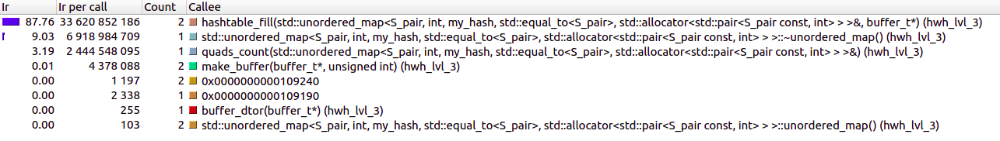

HWH (C++ standard & C implementation comparison)
============================
## Compare the duration of execution
----------------------------
## lvl_1-2: dictionary
| Test      | my hashtable | std::unordered_map  |
| :--------:|:------------:|:-------------------:|
| test_1    | 0m 0,002s    | 0m 0,010s           |
| test_2    | 0m 0,002s    | 0m 0,004s           |
| test_3    | 0m 0,002s    | 0m 0,004s           |
| test_4    | 0m 0,002s    | 0m 0,004s           |
| test_5    | 0m 0,009s    | 0m 0,026s           |
| test_6    | 0m 0,066s    | 0m 0,064s           |
| test_7    | 0m 0,001s    | 0m 0,003s           |
| test_8    | 0m 0,001s    | 0m 0,002s           |

### data:
* for [my hashtable](https://github.com/klauchek/C-contests/blob/main/hwh/lvl_1-2/tests_time.txt)
* for [std::unordered_map](https://github.com/klauchek/cpp_hws/blob/main/hwh/lvl_1-2/tests_time.txt)
---------------------------

## lvl_3: quads

| Test      | my hashtable | std::unordered_map  |
| :--------:|:------------:|:-------------------:|
| test_1    | 0m 0,007s    | 0m 0,010s           |
| test_2    | 0m 0,001s    | 0m 0,003s           |
| test_3    | 0m 0,008s    | 0m 0,009s           |
| test_4    | 0m 0,281s    | 0m 0,204s           |
| test_5    | 0m 7,284s    | 0m 5,629s           |
| test_6    | 0m 28,211s   | 0m 23,769s          |
| test_7    | 1m 0,573s    | 0m 51,567s          |
| test_8    | 1m 50,307s   | 1m 34,631s          |
| test_9    | 1m 59,121s   | 1m 45,208s          |
| test_10   | 6m 51,624s   | 2m 7,949s           |
### data:
* for [my hashtable](https://github.com/klauchek/C-contests/blob/main/hwh/lvl_3/tests_time.txt)
* for [std::unordered_map](https://github.com/klauchek/cpp_hws/blob/main/hwh/lvl_3/tests_time.txt)

__________________________________________________
__________________________________________________
## ***extra***
(*having fun with kcachegrind*)

**example: lvl_3, test_6**
__________________________________________________
### *generally*
* my_hashtable

 

* std::unordered_map

 

 ### *main*
* my_hashtable

 

* std::unordered_map

 

 ### *focus on hashtable_fill as most interesting*
* my_hashtable

 

* std::unordered_map

 
================
